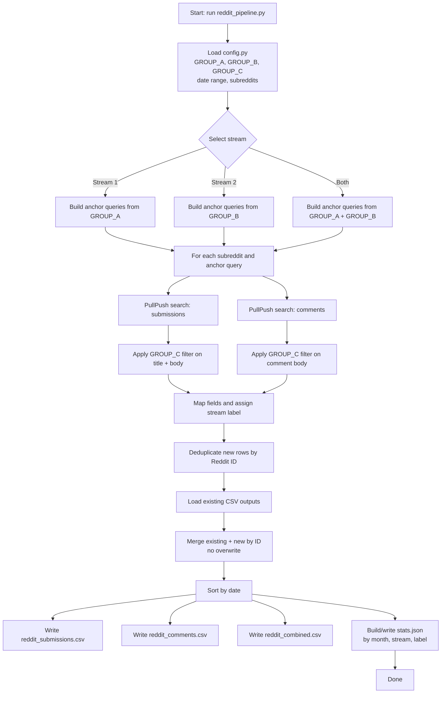

# Reddit Search Pipeline - LLM Task Discovery (Two-Stream)

Reproducible pipeline that pulls Reddit submissions and comments to study how
people use LLMs in practice, split into two distinct streams:

| Stream | Logical target | Anchor group queried |
|--------|----------------|----------------------|
| **Stream 1** | `(A) AND (C)` | `GROUP_A` (small/local terms) |
| **Stream 2** | `(B) AND (C)` | `GROUP_B` (large/general terms) |

## New pipeline design

The pipeline now uses a **two-stage retrieval strategy**:

1. Query PullPush with anchor terms only (`A` or `B`).
2. Apply a fast Python filter that keeps only rows whose text contains at least
   one `GROUP_C` use-practice term.

This preserves the same target logic (`A∩C` / `B∩C`) while dramatically reducing
API calls compared with an `AxC` / `BxC` Cartesian product search.

## Pipeline workflow plot



## Keyword groups (3 groups)

All keyword groups are defined in `config.py`.

### Group A - Small / local model terms (12)

`local llm`, `local model`, `self-hosted llm`, `on-device llm`, `offline llm`,
`run locally`, `private ai`, `edge ai`, `small language model`, `slm`,
`open-source model`, `on my machine`

### Group B - Large / general LLM terms (12)

`large language model`, `generative ai`, `ai assistant`, `chatgpt`, `claude`,
`gemini`, `copilot`, `perplexity`, `foundation model`, `frontier model`,
`genai`, `cloud model`

### Group C - Shared use-practice terms (9)

`use case`, `workflow`, `what do you use`, `how do you use`, `i use it for`,
`daily use`, `routine`, `in practice`, `helps me`

## Query count (new)

| Stream | Formula | Queries |
|--------|---------|---------|
| Stream 1 | `len(A)` | 12 |
| Stream 2 | `len(B)` | 12 |
| **Total API queries** | `len(A) + len(B)` | **24** |

`GROUP_C` is applied as an in-memory filter, not as additional API query terms.

## Data source

| Source | API base | Notes |
|--------|----------|-------|
| **PullPush** | `https://api.pullpush.io` | Free, no auth; uses full-text `q=` search |

## Stream-specific subreddit scope

The pipeline now uses separate default subreddit lists per stream:

- `small_local` (Stream 1): `LocalLLaMA`, `LocalLLM`, `SelfHosted`
- `large_general` (Stream 2): `ChatGPT`, `OpenAI`, `ClaudeAI`, `LLM`, `Gemini`

This prevents large/general LLM queries from being collected inside local-only
discussion communities by default.

## Quick start

```bash
# 1. Install dependencies
pip install -r requirements.txt

# 2. Run both streams (default)
python reddit_pipeline.py

# 3. Run one stream only
python reddit_pipeline.py --stream 1          # Stream 1: A anchor + C filter
python reddit_pipeline.py --stream 2          # Stream 2: B anchor + C filter

# 4. Custom date window
python reddit_pipeline.py --stream 1 --start 2024-01-01 --end 2024-12-31

# 5. Override subreddit scope for one stream only
python reddit_pipeline.py --subreddits-s1 LocalLLaMA LocalLLM SelfHosted
python reddit_pipeline.py --subreddits-s2 ChatGPT OpenAI ClaudeAI

# 6. Global subreddit override for all selected streams
python reddit_pipeline.py --subreddits ChatGPT OpenAI

# 7. Custom output directory
python reddit_pipeline.py --out /path/to/output
```

## Output files

| File | Description |
|------|-------------|
| `reddit_submissions.csv` | Unique posts (deduplicated by Reddit ID) |
| `reddit_comments.csv` | Unique comments (deduplicated by Reddit ID) |
| `reddit_combined.csv` | Posts + comments merged and sorted by date |
| `stats.json` | Counts by month, stream, and label |

### CSV columns

| Column | Description |
|--------|-------------|
| `source` | `pullpush` |
| `kind` | `submission` or `comment` |
| `id` | Reddit post/comment ID |
| `subreddit` | e.g. `LocalLLaMA` |
| `date` | `YYYY-MM-DD` (UTC) |
| `title` | Post title (empty for comments) |
| `body` | Selftext/comment body (truncated at 2000 chars) |
| `url` | Full permalink |
| `score` | Reddit upvote score |
| `num_comments` | Number of comments (submissions only) |
| `query` | Anchor term (`A` or `B`) that retrieved the record |
| `stream` | `small_local` or `large_general` |
| `task_labels` | Current label (same as `stream`) |

## Customizing keyword groups

Edit `GROUP_A`, `GROUP_B`, and `GROUP_C` in `config.py`.

- `GROUP_A` changes Stream 1 anchors
- `GROUP_B` changes Stream 2 anchors
- `GROUP_C` changes the shared post-retrieval use-practice filter

`SEARCH_QUERIES` is generated automatically from `GROUP_A` and `GROUP_B`.

## Reproducibility notes

- Keywords, date windows, and subreddit scope are version-controlled in `config.py`.
- Results are deduplicated by Reddit ID, so re-runs are idempotent.
- Existing CSV rows are loaded and merged; records are not overwritten.
- `stream` records which experimental arm retrieved each row.
- `stats.json` captures per-stream totals and query counts for comparison.

---

## Annotation processing — step-by-step

This section describes how the raw Reddit records are transformed into
**canonical task categories** and how tasks are judged to be **shared** between
the SLM and LLM streams.

### Step 1 — GPT-4o batch annotation (`annotate_batch.py`)

**Input:** `reddit_combined_stream1.csv` and `reddit_combined_stream2.csv`  
**Script:** `annotate_batch.py` using the OpenAI Batch API (50 % cheaper than
synchronous calls; `batch_state.json` lets interrupted jobs resume).

Each Reddit post or comment is sent to `gpt-4o` with a structured prompt that
asks the model to identify every concrete daily task mentioned in the text.
The model returns a JSON object per record:

```json
{
  "no_task_found": false,
  "tasks":       ["summarization", "translate document"],
  "task_themes": ["Information", "Information"],
  "task_subthemes": ["Summarize", "Search"],
  "evidence":    ["feeds it to my local LLM", "translate the PDF"],
  "notes":       "User describes two distinct use-cases."
}
```

Multiple tasks per record are stored pipe-separated (`|`) in the output CSV
columns `tasks`, `task_themes`, `task_subthemes`, and `evidence`.

**Output:** `reddit_annotated_stream1.csv` and `reddit_annotated_stream2.csv`

---

### Step 2 — Regex normalisation into canonical task labels (`task_analysis.ipynb`)

Because GPT-4o generates free-text task descriptions (e.g. "combine transcripts",
"extract transcripts from YouTube", "transcribe meeting audio"), similar labels
must be merged before any cross-stream comparison is possible.

**2a. Explode multi-task records**  
Each row in the annotated CSV can carry several pipe-separated tasks.
The notebook explodes these into one row per *(record × task)* pair.

**2b. Apply the `NORM_MAP` regex table**  
A hand-crafted mapping applies regular expressions to the lower-cased raw task
string and maps it to a canonical group name:

| Pattern | Canonical label |
|---|---|
| `transcri(be\|ption)` | `transcription` |
| `summar(iz\|is)(e\|ing\|ation)` | `summarization` |
| `cod(e\|ing)` | `coding / code generation` |
| `automat(ion\|e\|ing\|ed)` | `task automation` |
| `translat(e\|ion\|ing)` | `translation` |
| `writ(ing\|e\|ten)` | `creative writing` |
| `(planning\|schedul)` | `planning / scheduling` |
| … (35 patterns total) | … |

If no pattern matches, the raw label is kept as-is (long-tail tasks).

**Output column:** `_task_norm` (normalised canonical label per exploded row)

---

### Step 3 — Identify shared-task candidates (`task_analysis.ipynb`)

After normalisation the notebook computes the **set of unique canonical labels**
for each stream independently, then takes their **intersection**:

```python
tasks_slm = set(task_rows[task_rows['stream'] == 'small_local']['_task_norm'].dropna())
tasks_llm = set(task_rows[task_rows['stream'] == 'large_general']['_task_norm'].dropna())
shared    = tasks_slm & tasks_llm          # Python set intersection
```

A task label is considered **shared** if and only if it appears in at least one
manually annotated record in **both** streams. This is a label-level, not
mention-level, criterion — even a single mention in each stream qualifies.

One catch-all label (`coding / code generation`) is explicitly excluded from the
shared set because it is too broad to be informative for cross-stream comparison.

Every original record whose normalised task falls in `shared` is then exported to:

- `slm_shared_tasks.csv` — shared-task records from Stream 1 (SLM)
- `llm_shared_tasks.csv` — shared-task records from Stream 2 (LLM)

> **Important:** the export uses explicit stream-value constants
> (`SLM_STREAM = 'small_local'`, `LLM_STREAM = 'large_general'`) rather than
> alphabetically sorted indices, to prevent a silent stream-swap bug (alphabetical
> sort makes `'large_general'` rank before `'small_local'`).

---

### Step 4 — Post-review normalisation and analysis (`tasks_overlap.ipynb`)

**4a. Convert and clean**  
The checked xlsx files are loaded into `tasks_overlap.ipynb`. A second-pass
normalisation corrects residual inconsistencies introduced during manual editing
(mixed casing, legacy labels):

| Raw value | Normalised to |
|---|---|
| `advice` | `Advice` |
| `Information Search` | `Information` |
| `Inforamation` (typo) | `Information` |
| `automation` (lower) | `Automation` |
| `analyze` (lower) | `Analyze` |
| `guidance` (lower) | `Guidance` |

**4b. Re-derive the shared set**  
After manual review the task labels may have changed. The notebook recomputes
the shared-task set using the same Python set-intersection logic as Step 3,
now applied to the cleaned `task_canonical` column:

```python
tasks_slm_set = set(slm['task_canonical'].dropna().unique())
tasks_llm_set = set(llm['task_canonical'].dropna().unique())
shared_tasks  = sorted(tasks_slm_set & tasks_llm_set)
```

**Result after manual review:** 20 shared task labels across both streams.

| Shared task | SLM mentions | LLM mentions |
|---|---|---|
| creative writing | 17 | 21 |
| summarization | 18 | 11 |
| scripting | 8 | 12 |
| task automation | 7 | 11 |
| transcription | 11 | 2 |
| brainstorming | 1 | 8 |
| translation | 5 | 3 |
| planning / scheduling | 2 | 4 |
| agent workflow | 2 | 3 |
| analyze data | 1 | 4 |
| generate images | 1 | 4 |
| debugging | 2 | 2 |
| … (8 more) | … | … |

**4c. Export summary**  
The notebook writes `overlap_task_summary.csv` — one row per unique task label
with its overlap status (`shared` / `SLM only` / `LLM only`), per-stream mention
counts, and dominant theme for each stream.

---

### File lineage summary

```
reddit_combined_stream1.csv  ──┐
                               ├─► annotate_batch.py ──► reddit_annotated_stream1.csv ──┐
reddit_combined_stream2.csv  ──┘                                                         │
                                                                                          │
reddit_annotated_stream2.csv ────────────────────────────────────────────────────────────┤
                                                                                          │
                               task_analysis.ipynb                                        │
                               ├─ explode tasks                                           │
                               ├─ regex normalise (NORM_MAP)           ◄──────────────────┘
                               ├─ set intersection → shared labels
                               └─► slm_shared_tasks.csv
                                   llm_shared_tasks.csv
                                          │
                               Manual review (human)
                                          │
                               slm_shared_tasks_checked.xlsx
                               llm_shared_tasks_checked.xlsx
                                          │
                               tasks_overlap.ipynb
                               ├─ load + normalise themes/subthemes
                               ├─ re-derive shared set
                               └─► overlap_task_summary.csv
```
