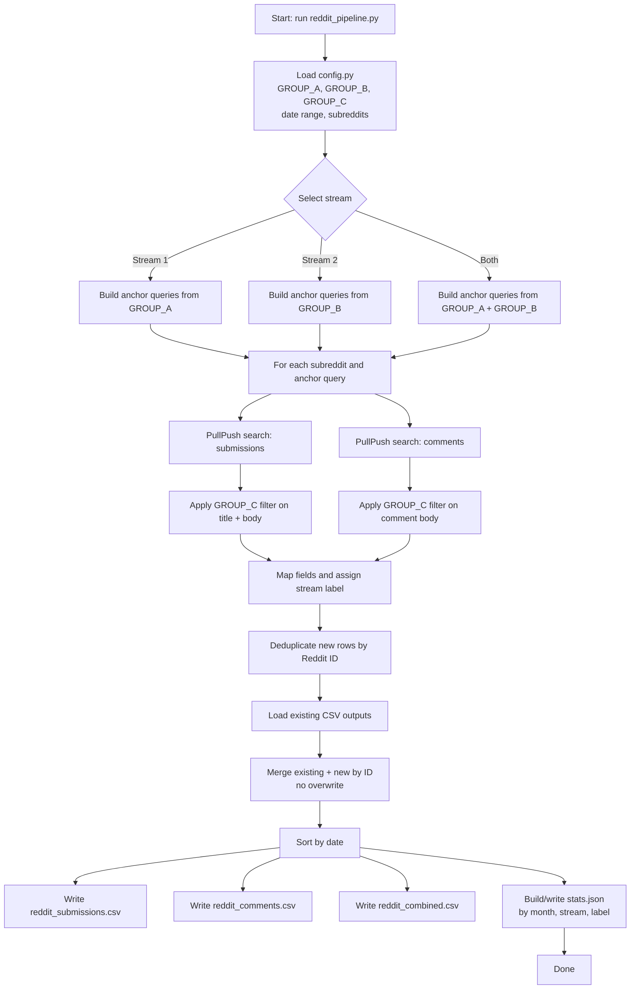

# Reddit Search Pipeline - LLM Task Discovery (Two-Stream)

Reproducible pipeline that pulls Reddit submissions and comments to study how
people use LLMs in practice, split into two distinct streams:

| Stream | Logical target | Anchor group queried |
|--------|----------------|----------------------|
| **Stream 1** | `(A) AND (C)` | `GROUP_A` (small/local terms) |
| **Stream 2** | `(B) AND (C)` | `GROUP_B` (large/general terms) |

## New pipeline design

The pipeline now uses a **two-stage retrieval strategy**:

1. Query PullPush with anchor terms only (`A` or `B`).
2. Apply a fast Python filter that keeps only rows whose text contains at least
   one `GROUP_C` use-practice term.

This preserves the same target logic (`A∩C` / `B∩C`) while dramatically reducing
API calls compared with an `AxC` / `BxC` Cartesian product search.

## Pipeline workflow plot



## Keyword groups (3 groups)

All keyword groups are defined in `config.py`.

### Group A - Small / local model terms (12)

`local llm`, `local model`, `self-hosted llm`, `on-device llm`, `offline llm`,
`run locally`, `private ai`, `edge ai`, `small language model`, `slm`,
`open-source model`, `on my machine`

### Group B - Large / general LLM terms (12)

`large language model`, `generative ai`, `ai assistant`, `chatgpt`, `claude`,
`gemini`, `copilot`, `perplexity`, `foundation model`, `frontier model`,
`genai`, `cloud model`

### Group C - Shared use-practice terms (9)

`use case`, `workflow`, `what do you use`, `how do you use`, `i use it for`,
`daily use`, `routine`, `in practice`, `helps me`

## Query count (new)

| Stream | Formula | Queries |
|--------|---------|---------|
| Stream 1 | `len(A)` | 12 |
| Stream 2 | `len(B)` | 12 |
| **Total API queries** | `len(A) + len(B)` | **24** |

`GROUP_C` is applied as an in-memory filter, not as additional API query terms.

## Data source

| Source | API base | Notes |
|--------|----------|-------|
| **PullPush** | `https://api.pullpush.io` | Free, no auth; uses full-text `q=` search |

## Stream-specific subreddit scope

The pipeline now uses separate default subreddit lists per stream:

- `small_local` (Stream 1): `LocalLLaMA`, `LocalLLM`, `SelfHosted`
- `large_general` (Stream 2): `ChatGPT`, `OpenAI`, `ClaudeAI`, `LLM`, `Gemini`

This prevents large/general LLM queries from being collected inside local-only
discussion communities by default.

## Quick start

```bash
# 1. Install dependencies
pip install -r requirements.txt

# 2. Run both streams (default)
python reddit_pipeline.py

# 3. Run one stream only
python reddit_pipeline.py --stream 1          # Stream 1: A anchor + C filter
python reddit_pipeline.py --stream 2          # Stream 2: B anchor + C filter

# 4. Custom date window
python reddit_pipeline.py --stream 1 --start 2024-01-01 --end 2024-12-31

# 5. Override subreddit scope for one stream only
python reddit_pipeline.py --subreddits-s1 LocalLLaMA LocalLLM SelfHosted
python reddit_pipeline.py --subreddits-s2 ChatGPT OpenAI ClaudeAI

# 6. Global subreddit override for all selected streams
python reddit_pipeline.py --subreddits ChatGPT OpenAI

# 7. Custom output directory
python reddit_pipeline.py --out /path/to/output
```

## Output files

| File | Description |
|------|-------------|
| `reddit_submissions.csv` | Unique posts (deduplicated by Reddit ID) |
| `reddit_comments.csv` | Unique comments (deduplicated by Reddit ID) |
| `reddit_combined.csv` | Posts + comments merged and sorted by date |
| `stats.json` | Counts by month, stream, and label |

### CSV columns

| Column | Description |
|--------|-------------|
| `source` | `pullpush` |
| `kind` | `submission` or `comment` |
| `id` | Reddit post/comment ID |
| `subreddit` | e.g. `LocalLLaMA` |
| `date` | `YYYY-MM-DD` (UTC) |
| `title` | Post title (empty for comments) |
| `body` | Selftext/comment body (truncated at 2000 chars) |
| `url` | Full permalink |
| `score` | Reddit upvote score |
| `num_comments` | Number of comments (submissions only) |
| `query` | Anchor term (`A` or `B`) that retrieved the record |
| `stream` | `small_local` or `large_general` |
| `task_labels` | Current label (same as `stream`) |

## Customizing keyword groups

Edit `GROUP_A`, `GROUP_B`, and `GROUP_C` in `config.py`.

- `GROUP_A` changes Stream 1 anchors
- `GROUP_B` changes Stream 2 anchors
- `GROUP_C` changes the shared post-retrieval use-practice filter

`SEARCH_QUERIES` is generated automatically from `GROUP_A` and `GROUP_B`.

## Reproducibility notes

- Keywords, date windows, and subreddit scope are version-controlled in `config.py`.
- Results are deduplicated by Reddit ID, so re-runs are idempotent.
- Existing CSV rows are loaded and merged; records are not overwritten.
- `stream` records which experimental arm retrieved each row.
- `stats.json` captures per-stream totals and query counts for comparison.
